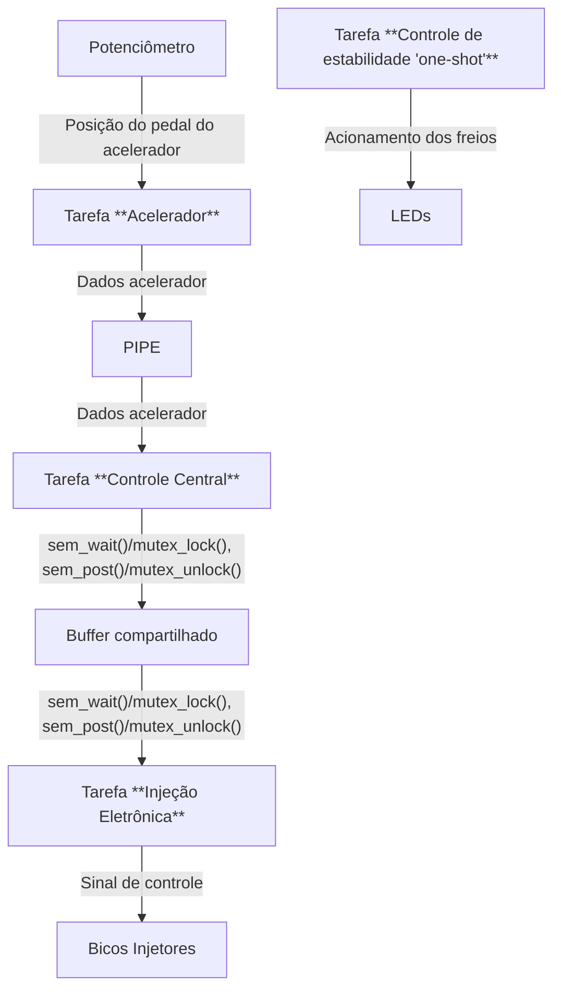

# Trabalho 1

## Enunciado

Tendo como base o RTOS desenvolvido em sala de aula, faça as seguintes inclusões na API deste:

1. Implementação do mecanismo de sincronização de tarefas baseado em variáveis mutex;
2. Implementação do algoritmo de escalonamento de tarefas baseado em prioridades;
3. Alterar a estrutura de dados do PIPE para que a mesma seja alocada dinamicamente ao invés de estaticamente;
4. Implementação de uma API de E/S para manipular os seguintes periféricos: PWM, ADC e interrupção externa.

Após a implementação dos itens citados acima, implemente uma aplicação embarcada para validar o RTOS desenvolvido. A aplicação a ser implementada está definida abaixo:

O sistema ilustrado acima é uma simplificação do sistema eletrônico de um motor de combustão interna e de um controle de estabilidade. O sistema embarcado possui três tarefas que executam todo o tempo, sendo elas:

- **Tarefa acelerador:** faz leituras da posição do pedal do acelerador e envia esta informação por meio de um PIPE para a tarefa "controle central".
- **Tarefa controle central:** recebe a informação da posição do pedal de aceleração da tarefa "acelerador", calcula qual será o tempo de abertura dos bicos injetores e então escreve esta informação em uma variável (buffer) compartilhada com a tarefa "injeção eletrônica".
- **Tarefa injeção eletrônica:** faz a leitura do tempo de acionamento dos bicos injetores na variável compartilhada e então controla a abertura dos bicos injetores gerando um sinal PWM para cada bico injetor do motor. Neste caso, são três bicos injetores.
- **Tarefa controle de estabilidade:** esta tarefa não ficará executando constantemente com as demais. Ela é conhecida como tarefa one-shot, ou seja, é uma tarefa que executa uma única vez em função de algum evento gerado. Esta tarefa é mais prioritária do que qualquer outra tarefa do sistema, logo a sua execução deve ser imediata, tão logo o evento seja gerado. A tarefa one-shot será criada quando a interrupção externa for gerada. Esta tarefa entrará em execução e simulará o controle de estabilidade de um veiculo, basicamente acionando os freios para manter o veiculo em linha reta.

Implemente o sistema embarcado de acordo com as especificações acima. Utilize a API do RTOS desenvolvida em aula para prover os recursos necessários para a execução da aplicação embarcada. Os recursos a serem utilizados basicamente são: escalonamento baseado em prioridades, API de E/S (leitura do periférico de ADC e geração de sinal PWM), sincronização de tarefas com semáforos ou variáveis mutex, e comunicação entre tarefas com PIPE.

## Informações Adicionais

Vocês poderá utilizar os seguintes componentes:

- Potenciômetro para simular o pedal do acelerador;
- Motores DC para simular os bicos injetores e;
- Leds para simular os atuadores dos freios.

O hardware poderá ser projetado no Proteus ou utilizar o PICsimlab disponível [aqui](https://github.com/lcgamboa/picsimlab).
